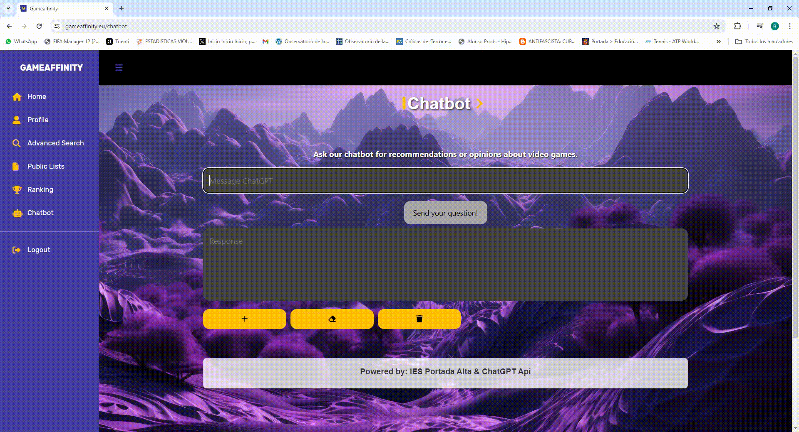
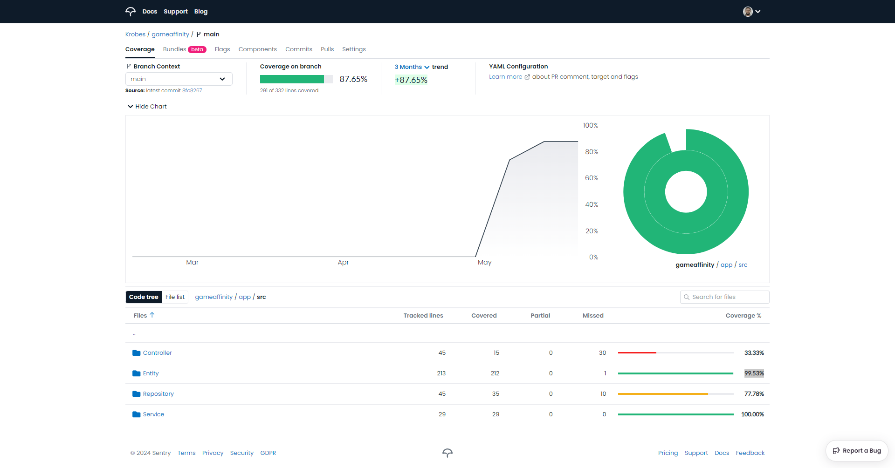

[](https://codecov.io/github/Krobes/gameaffinity)

# Project Gameaffinity

Gameaffinity is a web application where you can browse through our extensive
database of over 2000 games and perform advanced searches by developer,
genre, platform, and more. Additionally, enjoy the benefits of registering,
such as creating private lists to organize your favorite games or those you
wish to play, or public lists to share your tastes and recommendations with
others. Other advantages of registering include rating games and accessing our
chatbot section, where our AI can assist you with game recommendations or
opinions.

## Table of Contents

- [Prerequisites](#prerequisites)
- [Installation](#installation)
- [Deployment](#deployment)
- [Usage](#usage)
- [Testing](#testing)
- [Contributing](#contributing)
- [Sources of Information](#sources-of-information)
- [Contact](#contact)

## Prerequisites

Before getting started, make sure you have the following prerequisites installed:

- Docker

Additionally, to run dockers we use next ports:

- Nginx: 8081
- MySQL: 4306
- PHP: 9000

If any of these ports are not available, follow these steps:

1. Open the `docker-compose.yml` file in your preferred text editor.

2. Locate the section where the nginx service is defined.

3. Modify the port mapping so that the nginx container listens on an available port instead of the default port. For
   example:
   ```yaml
   services:
       nginx:
         container_name: nginx
         image: nginx:stable-alpine
         ports:
             - '8082:80'

## Installation

Clone the repository to your local machine:

```sh
git clone https://github.com/Krobes/gameaffinity.git
cd gameaffinity
docker-compose up

````

## Deployment

## Usage

### Create a List

Creating a list allows you to organize your favorite games or keep track of titles you plan to play. You can create
private lists for your own use or public lists to share with other users.


### Add a game to the list

Once you've created a list, you can easily add games to it. Simply navigate to the list you want to update, click on
the "Add Game" button, and then enter the title of the game you want to add. You can also add a brief description or any
other relevant information about the game.


### Rate games

Rating games allows you to share your opinion with other users and help them discover new titles. After playing a game,
you can assign it a rating based on your experience. This helps to create a community-driven ranking system and provides
valuable feedback to other users.


### Chatbot

The Gameaffinity website offers a variety of features and services for gaming enthusiasts. One of the key features is
the **Chatbot** section, where users can interact with a chatbot to ask questions about video games, get
recommendations, and more. The chatbot is designed to provide quick and helpful responses to enhance the user
experience.

Here is a demonstration video of the Chatbot in action:



## Testing

I have used PHPUnit to perform unit testing of my application, covering a large part of the
Entities, Repositories, and Services of the project.



## Contributing

If you'd like to contribute to the project, please open an issue or send a pull request.

## Contact

I'm glad to hear from you! If you have any questions, comments, or suggestions about this project, feel free to contact
me.

You can find me at:

- Mail: [rafa_lara@hotmail.es](mailto:tu_correo_electrónico@example.com)
- LinkedIn: [Rafael Bonilla Lara](https://www.linkedin.com/in/rafael-bonilla-lara-4521a32aa/)

## Sources of Information

Sources of information:

[Twilio - Get started with Docker and Symfony](https://www.twilio.com/en-us/blog/get-started-docker-symfony)

[PHP Unit- Official Documentation](https://docs.phpunit.de/en/9.6/fixtures.html)


